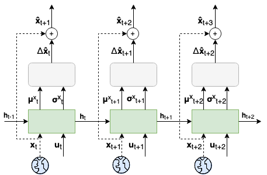

### Predictive Control Project
This work is developed by Justus Huebotter in 2022 as part of the SPIKEFERENCE project, co-founded by the Human Brain 
Project (HBP) and the Donders Institute for Brain, Cognition and Behaviour. 

In this project, we revisit policy optimization for low-level continuous control tasks and derive our methods from deep Active Inference (dAIF) 
In particular, we use prediction errors to learn the dynamics of the system in a *transition model*.
We show that we can then use this model to  drive the learning of an amortized *policy model* for goal reaching by imagining state trajectory rollouts, even when interaction with the real environment is limited.

The exact method used in this code base is explained in more detail in:

J. Huebotter, S. Thill, M. van Gerven, P. Lanillos (2022): **Learning Policies for Continuous Control via
Transition Models**, *3rd International Workshop on Active Inference* 

This publication is also available on arXiv (LINK HERE!!)

### Using the code

To use the code please clone this git via:

`git clone https://github.com/jhuebotter/predictive_control.git`

To install the required packages create a new local environment and run:

`pip install requirements.txt`

To enable wandb logging you will have to sign up at https://wandb.ai and call

`wandb login`

After this, the code should be executed by running :

`python pretrain_adaptive_model.py`

If desired, the parameters for the experiments can be changed in the `config.yaml` file. 
There are two environments currently supported: `plane` and `reacher2`. 
Please see below for example results for both environments with either static or moving targets.

### Example Results

#### Continuous control in a planar linear environment 

   

 

#### Continuous control of a planar robot arm

    
    

 

The auto-regressive prediction model learns to accurately forecast the state trajectory based on control inputs:

